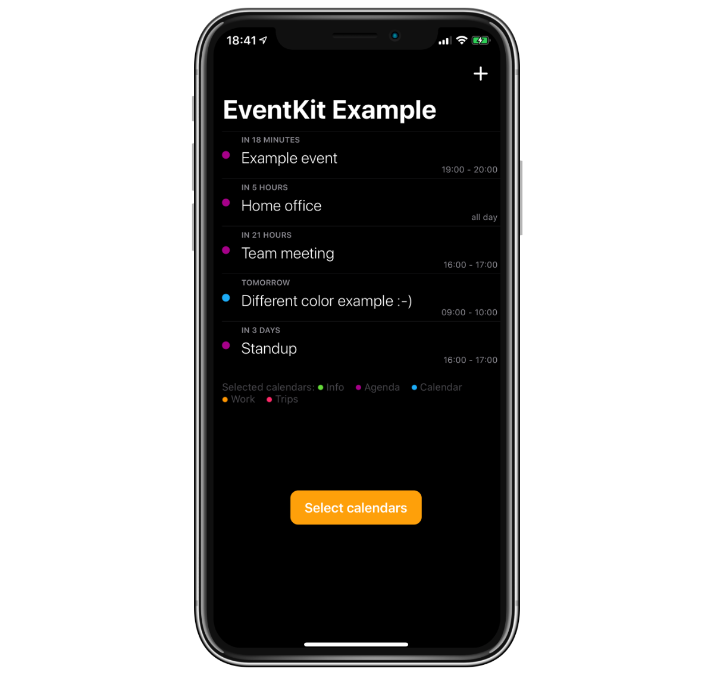

<p align="center">
  <a href="https://github.com/nemecek-filip/DynamicType-ReferenceApp">Dynamic Type</a> &bull;
  <b>Event Kit</b> &bull;
  <a href="https://github.com/nemecek-filip/QLPreviewController.Example">Quick Look</a> 	&bull;
  <a href="https://github.com/nemecek-filip/App-ideas">App Ideas</a> &bull;
  <a href="https://github.com/nemecek-filip/KeyboardPreview.iOS">Keyboard Preview</a>
  &bull;
  <a href="https://github.com/nemecek-filip/CompositionalDiffablePlayground.ios">Modern Collection Views</a>
</p>

----

# EKEventKit Example

You can read **more about EventKit** on my [website](https://nemecek.be/blog/series/eventkit).

#### SwiftUI version is currently work in progress. Feel free to help and suggest improvements. I have so far done just a little of SwiftUI..

[](https://twitter.com/nemecek_f)
[](https://github.com/nemecek-filip/EKEventKit.Example/blob/master/LICENSE)

### Simple example project showing basic parts of Event Kit like loading events from calendar, selecting calendar, editing events..

📅 This project shows loading `EKEvent`s from `EKEventStore` and accessing their properties to display calendar events in a Table View. It also demonstrates usage of `EKCalendarChooser` to let user choose calendars whose events to display. Events are added and edited via `EKEventEditViewController`. Events with location can be displayed on a map.

Not related stuff includes using `NSTextAttachment` inside `NSAttributedString` to display calendar colors with tinted images. And also how to implement swipe to delete in Table View with custom icon with the `trailingSwipeActionsConfigurationForRowAt` method.



I also have smaller projects showing [EKCalendarChooser](https://github.com/nemecek-filip/EKCalendarChooser.Example) and [EKEventEditViewController](https://github.com/nemecek-filip/EKEventEditViewController.Example).

## Quick overview of examples in the project

### Loading calendar events

```swift
let weekFromNow = Date().advanced(by: TimeInterval.week)
        
let predicate = eventStore.predicateForEvents(withStart: Date(), end: weekFromNow, calendars: Array(selectedCalendars))

events = eventStore.events(matching: predicate)
```

### Requesting calendar access

```swift
eventStore.requestAccess(to: .event) { (granted, error) in
    if granted {
        DispatchQueue.main.async {
            self.loadEvents()
            
            self.displaySelectedCalendars()
        }
    }
}
```

### Selecting calendars with the `EKCalendarChooser`

```swift
let chooser = EKCalendarChooser(selectionStyle: .multiple, displayStyle: .allCalendars, entityType: .event, eventStore: eventStore)
chooser.delegate = self
chooser.showsDoneButton = true
chooser.showsCancelButton = true
chooser.selectedCalendars = selectedCalendars
    
let nvc = UINavigationController(rootViewController: chooser)
    
present(nvc, animated: true, completion: nil)
```

### Implementing `EKCalendarChooserDelegate`

```swift
extension ViewController: EKCalendarChooserDelegate {
    func calendarChooserDidFinish(_ calendarChooser: EKCalendarChooser) {
        dismiss(animated: true, completion: nil)
        
        selectedCalendars = calendarChooser.selectedCalendars
        displaySelectedCalendars()
        loadEvents()
    }
    
    func calendarChooserDidCancel(_ calendarChooser: EKCalendarChooser) {
        dismiss(animated: true, completion: nil)
    }
}
```

Convenience `EKEvent` extensions:

```swift
extension EKEvent {
    var hasGeoLocation: Bool {
        return structuredLocation?.geoLocation != nil
    }
    
    var isBirthdayEvent: Bool {
        return birthdayContactIdentifier != nil
    }
}
```

## Other stuff to check out
* [Example project](https://github.com/nemecek-filip/QLPreviewController.Example) showing Quick Look framework: Usage of `QLPreviewController` and `QLPreviewGenerator` to display and generate previews of various files like PDF, Pages documents, Keynote presentation, images and more.
* [Dynamic Type - Reference App](https://github.com/nemecek-filip/DynamicType-ReferenceApp) to quickly preview Dynamic Type fonts so you can **visualize** them instead of just guessing.
* [App Ideas](https://github.com/nemecek-filip/App-ideas) repo with some ideas for apps to build :-)
* [Keyboard Preview](https://github.com/nemecek-filip/KeyboardPreview.iOS) - small app to preview all available keyboard settings in iOS.
* _More to come_